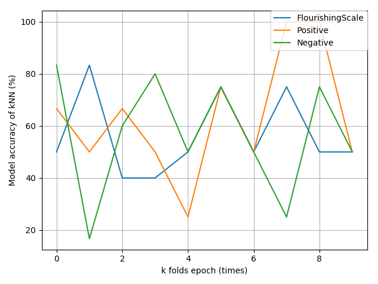
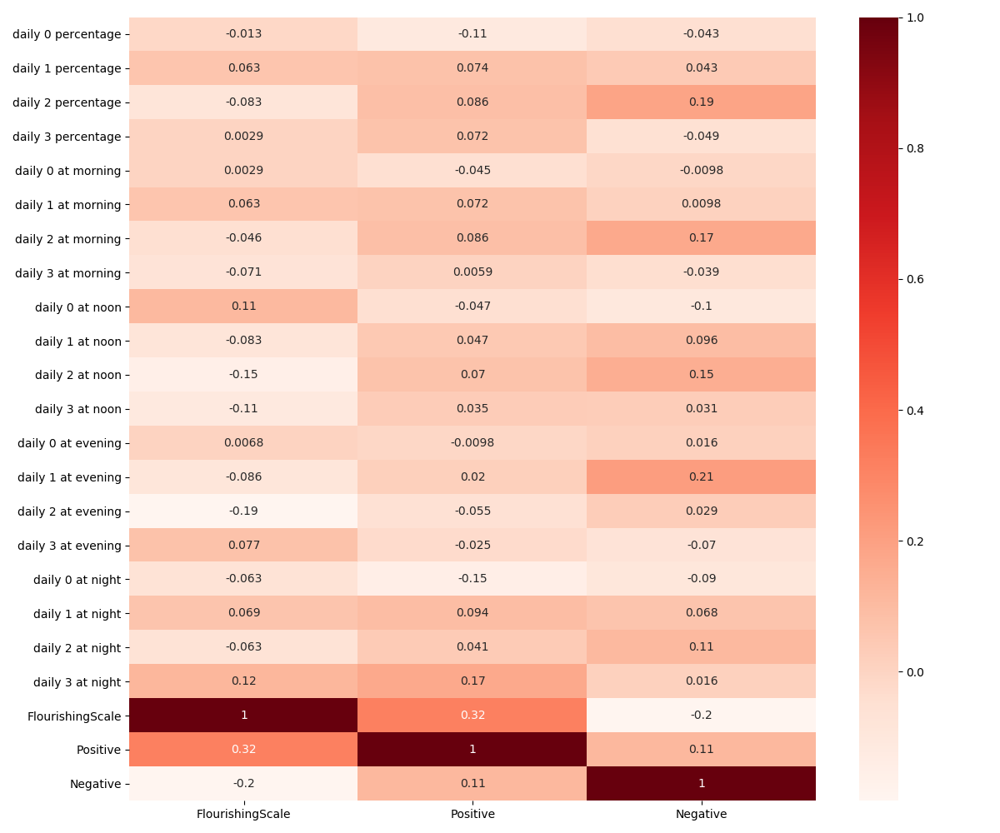

# 9417Project

## 0. 用已有数据训练模型

目前用kNN, LogisticRegression, RandomForest三种方法实现了三个弱智模型,仍需调参



`kNN.py,logistic_regression.py,random_forest.py`这三个文件中都实现了数据集获取，模型训练，k fold交叉验证，与
accuracy制图等功能，可作为参考

### 怎样使用?

*  重新下载项目(建议)

因为对比开头已作出太多更改 建议重新下载此项目，尤其是processed_data文件夹不可或缺

* 调节threshold:
    
在各个model的训练中都使用了`get_dataset.py`的`get_data_sets(threshold)`方法，此函数接受一个阈值，
返回与output各指标间相关系数超过了该阈值的所有指标作为数据集(无论正负相关)


* 调参及实现其它model:

可以在上述的三个model文件的基础上 修改其中的`evaluate_model()`方法，以实现其它模型或者找到更好的参数...


## 1.How to use github:

Commit all codes to local repositories
          
`git add .`

`git commit -m "message"`

Commit the codes to remote repositories

`git push`

Pull new codes(of others) from remote

`git pull`

## 2.info

### 2.1 项目文件结构
````
.
├── README.md
├── StudentLife_Dataset
│   ├── Inputs
│   ├── Outputs
│   └── StudentLIfe_AssessingMentalHealth.pdf
├── calc_corr.py
├── data_export
│   └── activity.py
├── process_input.py
├── process_output.py
├── processed_data
│   ├── activity.csv
│   └── output_value.csv
└── test.py
````

这样子data_export里面的文件相对路径则可以是

`fn = "../StudentLife_Dataset/Inputs/sensing/activity/activity_u00.csv"`

### 2.2 应用correlation做特征选择

打开test.py,修改in_dict 为对应的input

input应形如:
```
input_dict={
    "uid":[feature1,feture2...],
    亦即
    "u00":[1,2,3,4,5...]
    "u01":[1,2,3,4,5...]
    ...
    "u59":[1,2,3,4,5...]
}
```
 
 然后运行test.py即可得到对应的input与output中三个指标的相关系数
 
 `get_corr()`除了input_dict之外接受多个attr:
 
 * `heatmap` 是否plot热力图
 * `output_type` 选用的output数据为原始数值 `output_type="val"` 或者
  选用的output数据为以中位数为分界的分类 `output_type="class"` 此时 数值0 代表"LOW"
  数值1 代表 "HIGH"
 * `reduce_dim` 如果input_dict里面的features实在是太多 
 可应用`reduce_dim=True` 将input利用PCA降维 
 再看降维后的相关系数(此时应着眼于X0,X1,...)数字越后的所能代表原有input数据越少
 * `labels_of_input` input中各个feature的名字 方便辨认
 
 
一个示例的相关系数热力图:


